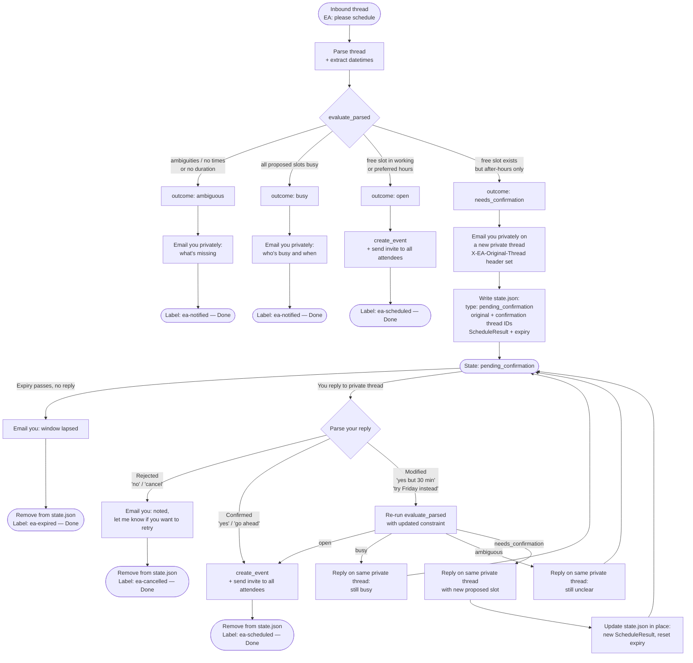
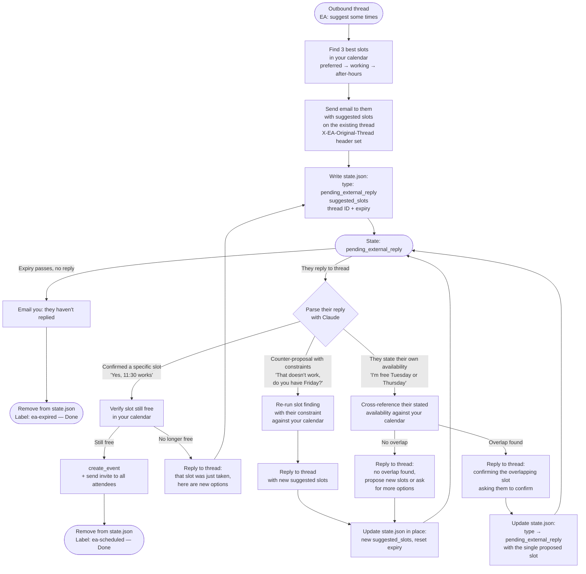

# EA Scheduling State Machine

## Overview

Two directions of scheduling exist:

- **Inbound** — someone emails you asking for a meeting; you reply `EA: please schedule`.
- **Outbound** — you want to propose a meeting; you send an email to them with `EA: suggest some times`.

In both cases the EA detects an `EA:` trigger, but the subsequent flow and the party being waited on differ. Completed threads are marked with Gmail labels and removed from the state store. `state.json` only holds threads actively awaiting a reply.

---

## Intents

| Intent | Trigger example | Direction |
|---|---|---|
| `meeting_request` | `EA: please schedule` (reply to inbound email) | Inbound |
| `suggest_times` | `EA: suggest some times to meet` (on an outgoing email) | Outbound |
| `block_time` | `EA: block Thursday 12–1pm for lunch` (email to self) | Self |

---

## Inbound Flow

Someone emails you asking for a meeting. You reply `EA: please schedule`.



---

## Outbound Flow

You are initiating. You compose an email to someone and include `EA: suggest some times to meet`. The EA finds your best available slots and sends them on your behalf. You are now waiting on *their* reply.



---

## Poll Loop

Each poll cycle runs three passes in order:

### Pass 1 — New `EA:` triggers
Scan threads not yet labeled `ea-*` for an `EA:` reply from your own email address. For each found, detect the intent and run the appropriate pipeline (inbound or outbound).

### Pass 2 — Pending confirmations (inbound)
For each `pending_confirmation` entry in `state.json`, check whether the private confirmation thread has a new reply from you since the last poll. If so, run the confirmation handler.

### Pass 3 — Pending external replies (outbound)
For each `pending_external_reply` entry in `state.json`, check whether the original thread has a new reply from the other party since the last poll. If so, run the external reply handler.

---

## State Store Schema

File: `state.json` (project root)

```json
{
  "<original_gmail_thread_id>": {
    "type": "pending_confirmation | pending_external_reply",
    "confirmation_thread_id": "<gmail_thread_id_of_private_ea_email>",
    "created_at": "<ISO 8601>",
    "expires_at": "<ISO 8601>",

    "schedule_result": {
      "outcome": "needs_confirmation",
      "slot_start": "<ISO 8601>",
      "slot_end": "<ISO 8601>",
      "slot_type": "after_hours",
      "topic": "...",
      "attendees": ["..."],
      "duration_minutes": 30,
      "parsed": {}
    },

    "suggested_slots": [
      { "start": "<ISO 8601>", "end": "<ISO 8601>", "slot_type": "preferred" }
    ]
  }
}
```

`schedule_result` is populated for `pending_confirmation`.
`suggested_slots` is populated for `pending_external_reply`.
Both may be present if a confirmation round followed an outbound suggestion.

---

## Gmail Labels

| Label | Meaning |
|---|---|
| `ea-scheduled` | Event created and invite sent |
| `ea-notified` | You were informed of ambiguity or conflict; no further action needed |
| `ea-cancelled` | You explicitly rejected the proposed slot |
| `ea-expired` | Reply window lapsed with no response |

Labels are applied to the **original thread** (inbound: the email from them; outbound: the email you sent), so the outcome is visible in context.

---

## Email Headers

All EA-initiated outbound emails carry:

```
X-EA-Original-Thread: <original_gmail_thread_id>
```

This provides a stable lookup key back to the state store entry regardless of subject line or body content. The poll loop uses this header when scanning threads to identify which are EA-managed.

---

## Recursive Rounds

Both flows support multiple back-and-forth rounds without opening new threads:

- **Inbound**: your modified reply re-runs `evaluate_parsed`; the result is sent on the same private thread; `state.json` updated in place.
- **Outbound**: their counter-proposal re-runs slot-finding; new suggestions are sent on the same original thread; `state.json` updated in place.

In both cases `expires_at` is reset on each exchange, so a genuine negotiation does not silently time out mid-conversation.
